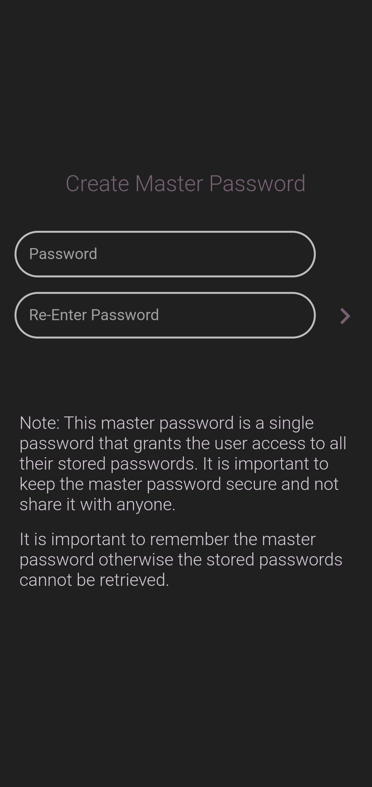
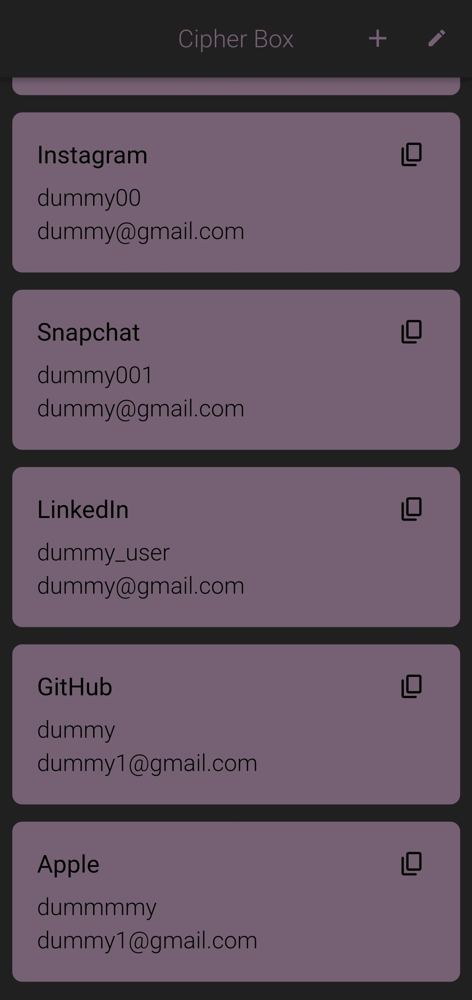
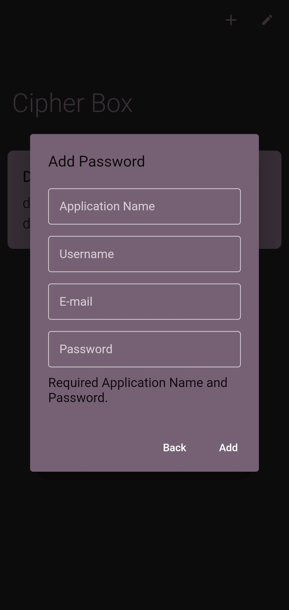
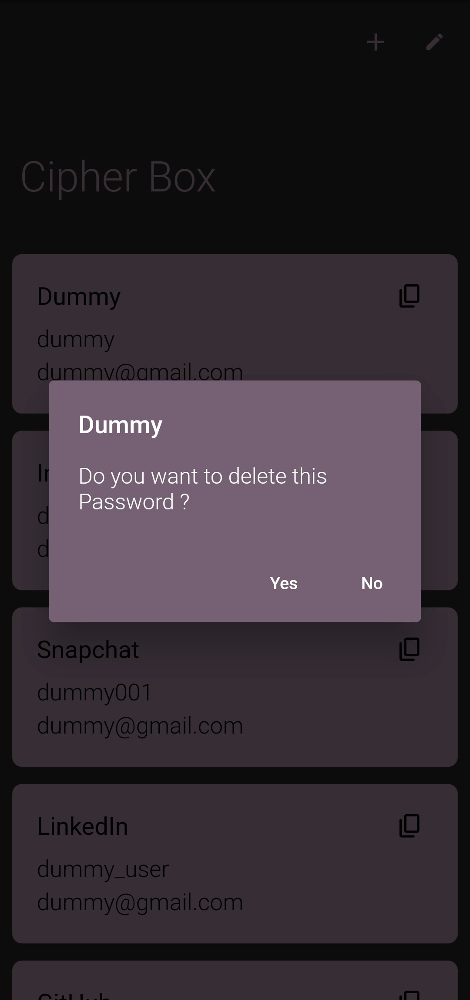
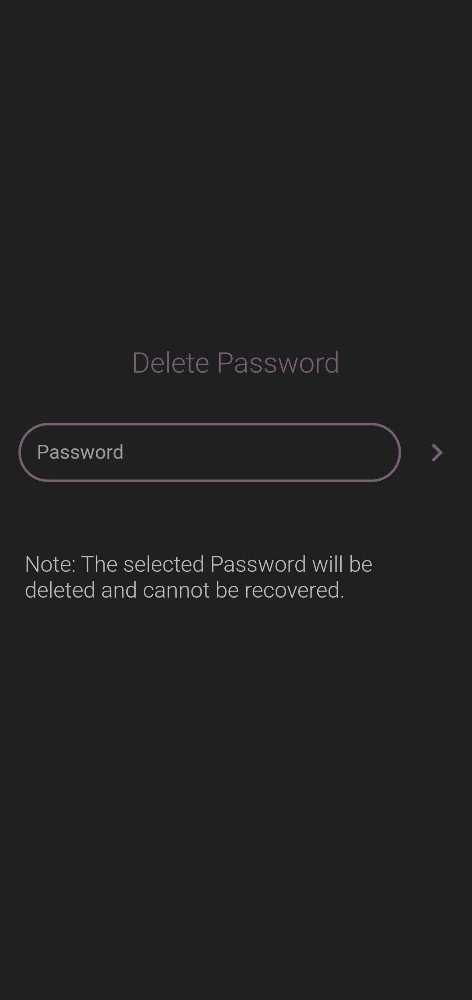
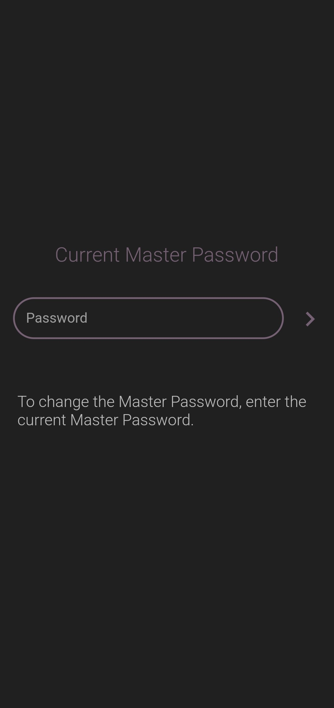
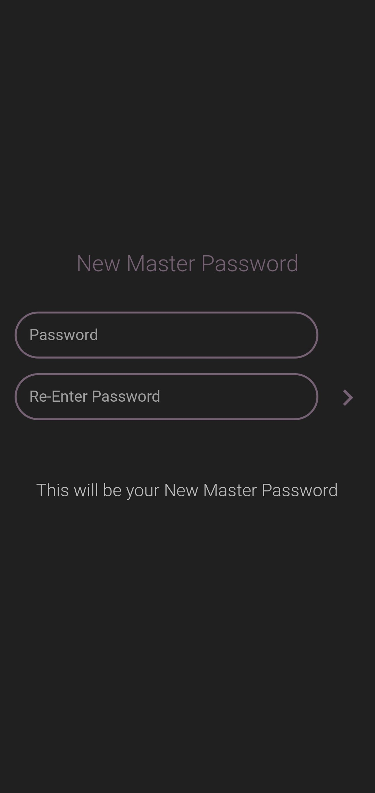

<h1 align="center">
Cipher Box
</h1>

<h6 align='right'><a href = 'https://github.com/nishanth1000/CipherBox-FlutterApp/releases/download/v0.1.0/CipherBox.apk'>Download the App </a></h6>

• An offline Password Manager App which uses Hive Database to store User's credentials. 
• Built using Flutter.

## Features

• This application uses Hive's built-in AES encryption algorithm to store the passwords.
• Password are not visible, instead they are copied to clipboard.

## Screenshots

### Create Master Password Screen
<pre>
  
</pre>

### Home Screen
<pre>
  
</pre>

### Password copied Intimation
<pre>

</pre>

### Add Password
<pre>

</pre>

### Delete Password
<pre>
 
</pre>

### Edit Master Password
<pre>
 
</pre>